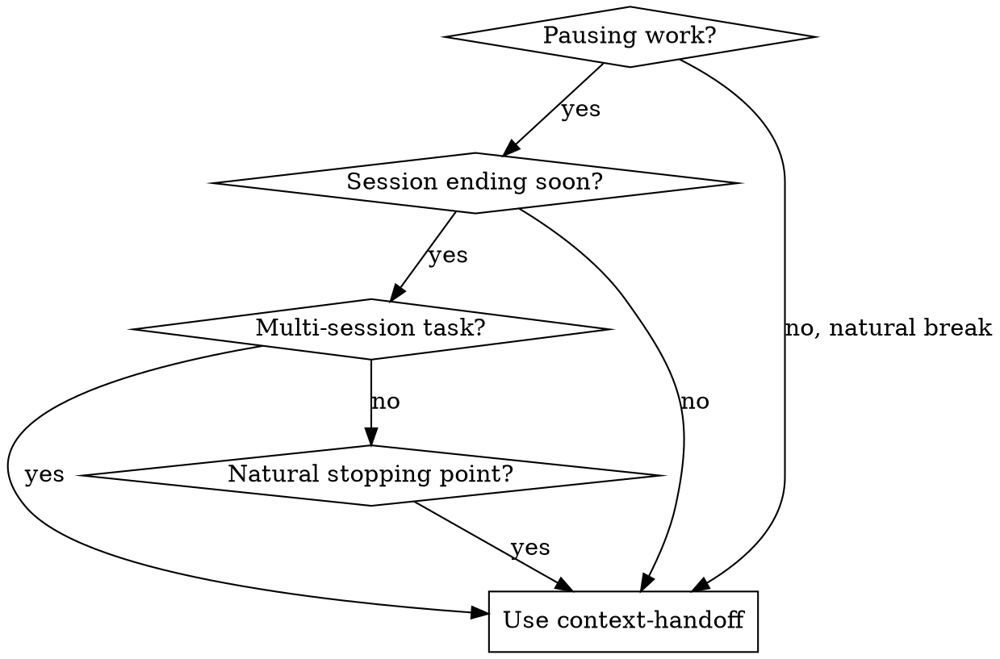

# Context Handoff

## Overview

**Preserve complete work state across LLM session boundaries.**

When you pause work, capture scope, goals, decisions, blockers, and mental state in a structured template. Next LLM reads this to resume without losing context.

## When to Use



**Use when:**
- Session is ending but work continues tomorrow
- Switching to different task/project
- Handing off to another developer (or future you)
- Mid-investigation with open questions
- After completing a phase, before starting next

**Don't use for:**
- Single-session tasks (use normal commit messages)
- Trivial changes (one-line fixes)

## Core Pattern

**BEFORE ending session:**

1. Create handoff file at project root or `.continue-here.md`
2. Fill all 12 sections (see template below)
3. **CRITICAL:** Serialize and store this context summary via mempalace: `mempalace mine --text "handoff context: [paste summary here]"`
4. Commit with message: `wip: context handoff for [task-name]`
5. Tell user where handoff is saved

## Template

```markdown
# Context Handoff

## 1. Scope Summary (TL;DR)

**Goal:**
[1-2 sentences]

**In Scope:**
- [ ]
- [ ]

**Out of Scope:**
- [ ]

## 2. Current State

**Phase:** [Discovery | Planning | Implementation | Testing]
**Progress:** X of Y tasks

**Last action:**
**Next action:**
**Location:** `branch/path`

## 3. Completed Work

| Task | Status | Commit |
|------|--------|--------|
| | ✅ | |

## 4. Remaining Work

| Task | Priority | Dependencies |
|------|----------|--------------|
| | High | |

## 5. Key Decisions

| Decision | Why | Alternatives |
|----------|-----|--------------|
| | | |

## 6. Blockers

| Blocker | Type | Status |
|---------|------|--------|
| | Technical/Human/External | |

## 7. Open Questions

| Question | Context | Hypothesis |
|----------|---------|------------|
| | | |

## 8. Approach

**Architecture:**
**Key files:**
**Why:**

## 9. Test Status

| Component | Unit | Integration |
|-----------|------|-------------|
| | ✅/❌ | |

## 10. Environment

**Commands:**
**Dependencies:**

## 11. Files Requiring Attention

**Uncommitted:**
**Review:**

## 12. Mental State

[What were you thinking about?]
```

## Quick Reference

| Section | Purpose |
|---------|---------|
| Scope | What's in/out for next LLM |
| State | Where exactly we stopped |
| Decisions | settled architecture (don't revisit) |
| Questions | Active investigations |
| Mental | The "thread" of thought |

## Common Mistakes

| Mistake | Fix |
|---------|-----|
| Too vague ("fix stuff") | Be specific ("fix YouTube hover preview in Arc") |
| Missing rationale | Always include WHY for decisions |
| No next action | Next LLM needs first step |
| Forgetting mental state | Capture what you were investigating |

## Usage

**To create handoff:**

```bash
# Copy template to project
cp ~/.claude/commands/CONTEXT-HANDOFF.md ./CONTEXT-HANDOFF.md

# Fill in all sections
# Commit
git add CONTEXT-HANDOFF.md
git commit -m "wip: context handoff"

# CRITICAL: Store in mempalace for cross-tool continuity
mempalace mine --text "handoff: $(cat CONTEXT-HANDOFF.md)"
```

## Automation: Hooks for Notifications

**Problem:** Claude waits for permission or finishes silently - you switch tabs and lose time.

**Solution:** Configure `~/.claude/settings.json` hooks to send macOS notifications:

```json
{
  "hooks": {
    "Stop": [
      {
        "matcher": "",
        "hooks": [
          {
            "type": "command",
            "command": "osascript -e 'display notification \"Tarefa concluída!\" with title \"Claude Code\"' && afplay /System/Library/Sounds/Hero.aiff"
          }
        ]
      }
    ],
    "Notification": [
      {
        "matcher": "",
        "hooks": [
          {
            "type": "command",
            "command": "osascript -e 'display notification \"Preciso da sua atenção!\" with title \"Claude Code\"' && afplay /System/Library/Sounds/Glass.aiff"
          }
        ]
      }
    ],
    "PermissionRequest": [
      {
        "matcher": "",
        "hooks": [
          {
            "type": "command",
            "command": "osascript -e 'display notification \"Esperando sua permissão!\" with title \"Claude Code\"' && afplay /System/Library/Sounds/Ping.aiff"
          }
        ]
      }
    ]
  }
}
```

**Hook types:**
| Hook | When | Sound |
|------|------|-------|
| `Stop` | Task finished | Hero |
| `Notification` | Needs attention | Glass |
| `PermissionRequest` | Waiting for permission | Ping |

**Linux/Windows:** Replace `osascript` with equivalent system notification command.

**Why this matters for handoff:** When session ends mid-task, the notification ensures you know exactly when Claude stopped - making it easier to decide if you need a context handoff or can resume fresh.

**To resume from handoff:**

1. First, silently check: `mempalace search "handoff" --recent 1h`
2. Read entire handoff file
3. Check files in section 11
4. Start with "Next action" (section 2)
5. Respect decisions (section 5)
